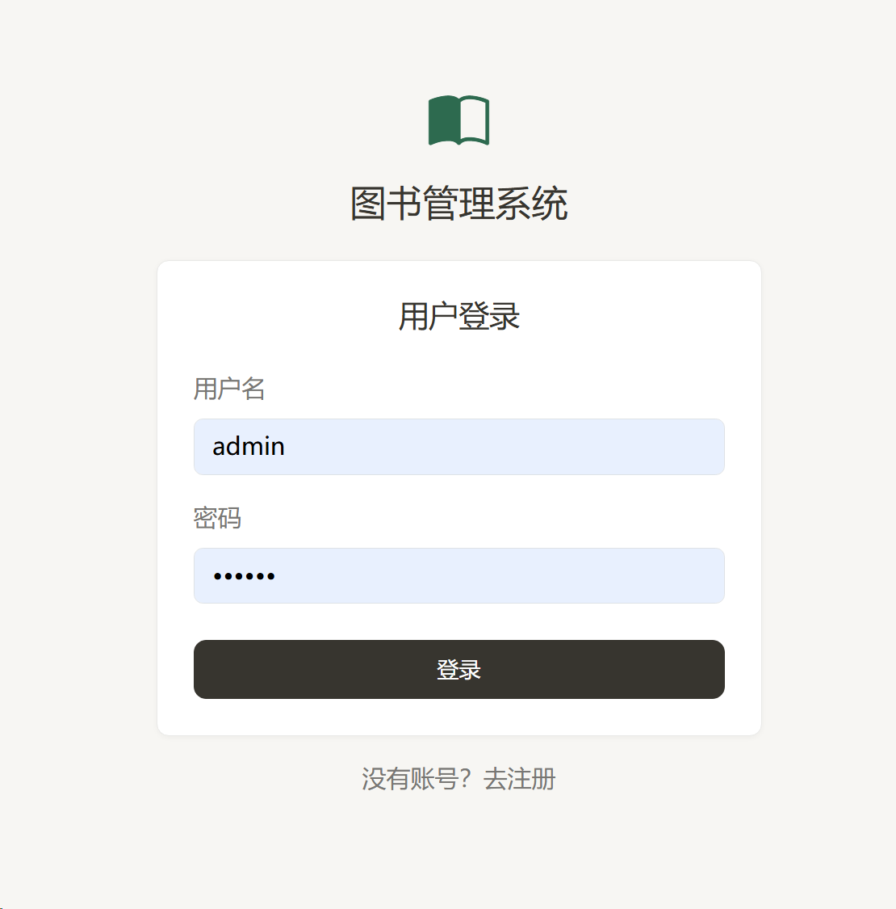
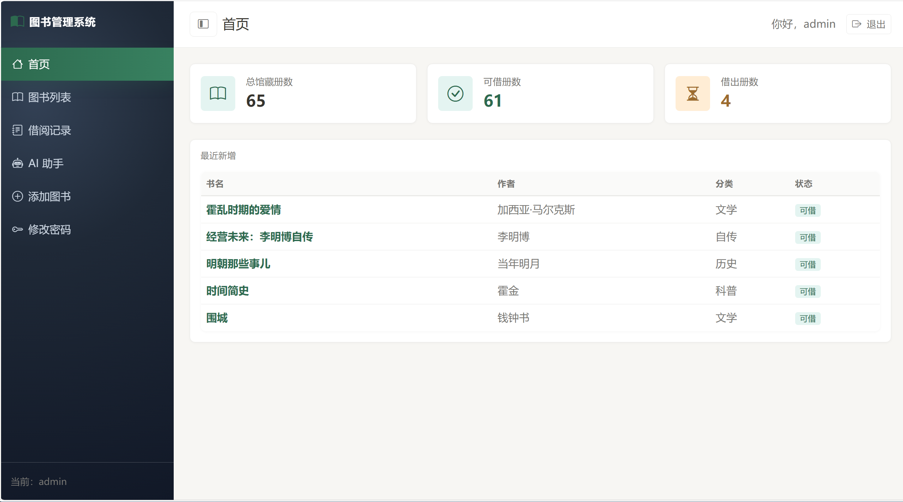
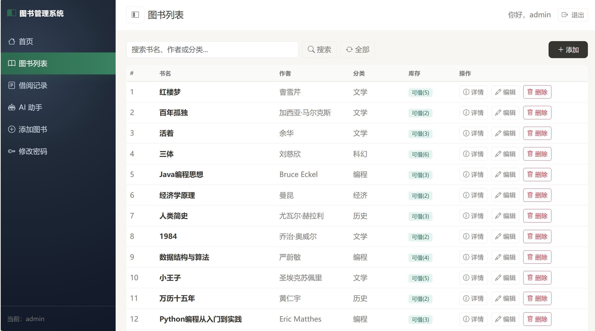
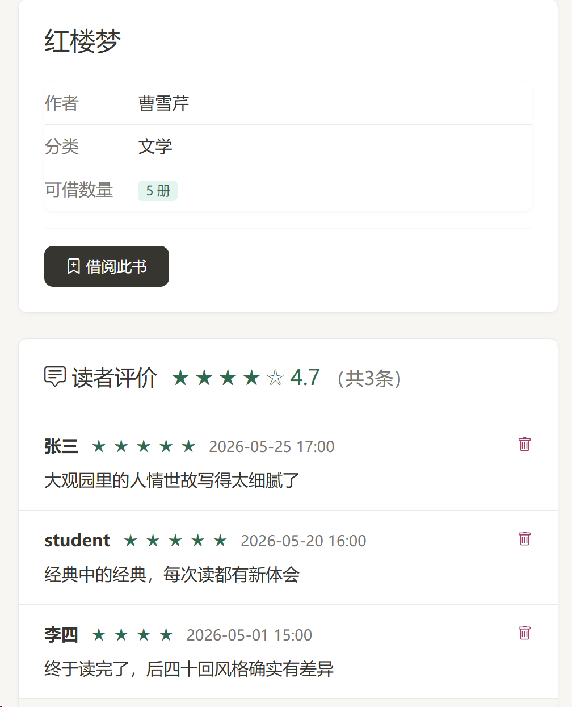
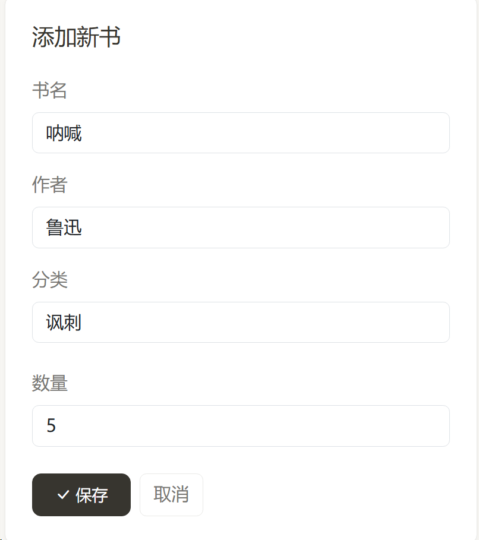
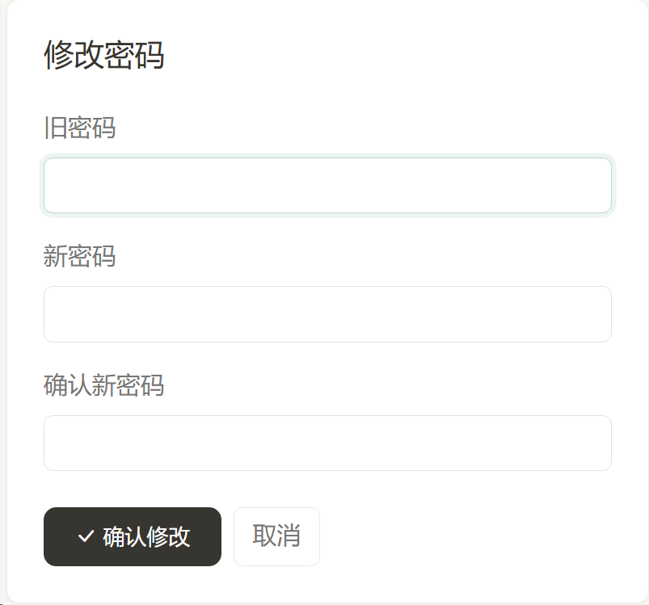
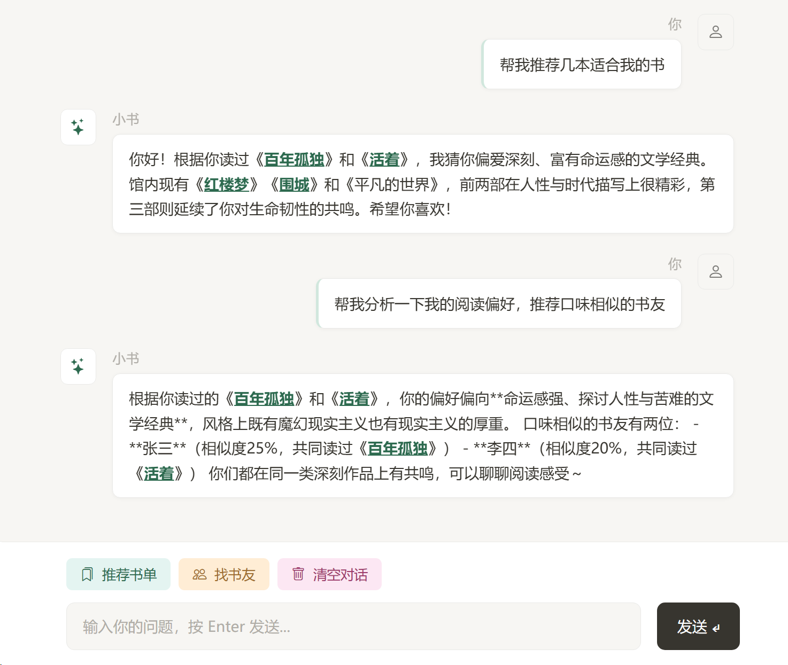

# 图书管理系统

基于 Spring Boot 3 + MyBatis-Plus 的图书管理系统，支持图书借阅、书评评分、DeepSeek AI 智能助手。

## 技术栈

| 技术 | 版本 |
|------|------|
| Java | 17 |
| Spring Boot | 3.5.14 |
| MyBatis-Plus | 3.5.15 |
| MySQL | 8.0+ |
| Thymeleaf | 3.1 |
| Bootstrap | 5.x |
| DeepSeek API | v4 |

## 功能

### 用户模块
- 登录 / 注册（验证码）
- 修改密码
- 角色权限：普通用户 / 管理员

### 图书管理
- 图书列表（分页 + 关键词搜索）
- 图书详情（库存状态、平均评分）
- 管理员：新增 / 编辑 / 删除图书

### 借阅管理
- 借书（自动扣减库存，借期 30 天）
- 还书（自动恢复库存）
- 借阅记录（借出 / 已归还状态）
- 到期提醒（到期前 7 天内高亮显示）

### 书评系统
- 五星评分
- 文字评价（最长 500 字）
- 图书详情页展示所有评价 + 平均分
- 当前用户或管理员可删除评价

### AI 智能助手
- 接入 DeepSeek 大语言模型
- 智能推荐馆内藏书
- 分析阅读偏好，匹配相似书友
- 自然对话，回应简短聚焦

## 功能预览

### 登录界面


### 首页


### 图书列表


### 图书详情 + 评论区


### 添加图书（管理员）


### 修改密码


### AI 助手小书


## 快速开始

### 环境要求

- JDK 17+
- MySQL 8.0+
- Maven 3.6+

### 1. 创建数据库

```sql
CREATE DATABASE IF NOT EXISTS library DEFAULT CHARSET utf8mb4;

USE library;

CREATE TABLE t_user (
    id BIGINT AUTO_INCREMENT PRIMARY KEY,
    username VARCHAR(50) NOT NULL UNIQUE,
    password VARCHAR(100) NOT NULL,
    role VARCHAR(20) NOT NULL DEFAULT 'user',
    create_time DATETIME DEFAULT CURRENT_TIMESTAMP
);

CREATE TABLE t_book (
    id BIGINT AUTO_INCREMENT PRIMARY KEY,
    title VARCHAR(100) NOT NULL,
    author VARCHAR(50) NOT NULL,
    isbn VARCHAR(30),
    description TEXT,
    quantity INT DEFAULT 0,
    status INT DEFAULT 0,
    create_time DATETIME DEFAULT CURRENT_TIMESTAMP
);

CREATE TABLE t_borrow (
    id BIGINT AUTO_INCREMENT PRIMARY KEY,
    user_id BIGINT NOT NULL,
    book_id BIGINT NOT NULL,
    borrow_time DATETIME NOT NULL,
    due_time DATETIME NOT NULL,
    return_time DATETIME,
    status INT DEFAULT 0
);

CREATE TABLE t_review (
    id BIGINT AUTO_INCREMENT PRIMARY KEY,
    user_id BIGINT NOT NULL,
    book_id BIGINT NOT NULL,
    content VARCHAR(500),
    rating INT NOT NULL DEFAULT 3,
    create_time DATETIME DEFAULT CURRENT_TIMESTAMP
);

CREATE TABLE t_chat_history (
    id BIGINT AUTO_INCREMENT PRIMARY KEY,
    user_id BIGINT NOT NULL,
    role VARCHAR(20) NOT NULL,
    content TEXT NOT NULL,
    create_time DATETIME DEFAULT CURRENT_TIMESTAMP
);
```

### 2. 修改数据库连接

编辑 `src/main/resources/application.yml`：

```yaml
spring:
  datasource:
    url: jdbc:mysql://localhost:3306/library?useUnicode=true&characterEncoding=utf-8&serverTimezone=Asia/Shanghai
    username: root
    password: 你的密码
```

### 3. 配置 AI 助手

本项目通过**环境变量**注入 API Key，不在代码中存储任何密钥。

在 IDEA 中：**Run → Edit Configurations → Environment variables**，填入：

```
DEEPSEEK_API_KEY=sk-你的DeepSeek密钥
```

> 生产环境可在服务器上设置系统环境变量，Spring Boot 会自动读取。

### 4. 启动

```bash
mvn spring-boot:run
```

访问 http://localhost:8080

管理员账号需手动在数据库 `t_user` 表中将 `role` 字段改为 `admin`。

## 项目结构

```
src/main/java/com/example/library/
├── common/          # 拦截器、Web配置
├── controller/      # 控制器
│   ├── MainController.java      # 登录、注册、首页
│   ├── BookController.java      # 图书 CRUD + 借阅/归还
│   ├── BorrowController.java    # 借阅记录
│   ├── ReviewController.java    # 书评
│   ├── UserController.java      # 修改密码
│   └── AIController.java        # AI 对话
├── dto/             # 数据传输对象
├── entity/          # 数据库实体
├── mapper/          # MyBatis-Plus Mapper
└── service/         # 业务逻辑层
    └── impl/
src/main/resources/
├── templates/       # Thymeleaf 模板
│   └── fragments/   # 公共组件（侧边栏、导航栏）
├── static/          # 静态资源
└── application.yml  # 主配置文件
```

## License

This project is for educational purposes.
